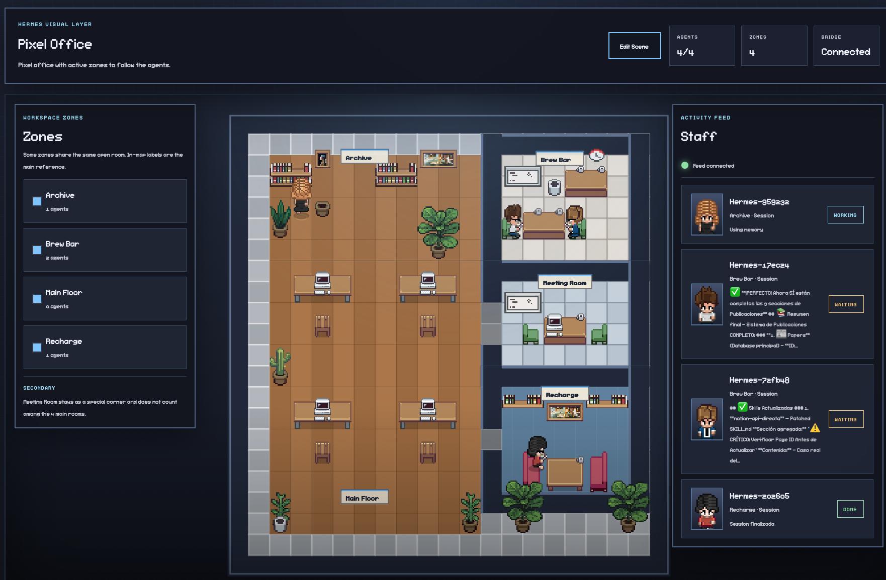

# 🎮 Hermes Pixel UI

[](https://www.python.org/)
[](https://react.dev/)
[](https://fastapi.tiangolo.com/)
[](#how-it-works)
[](#privacy--github-safety)

A pixel-art operations room for **Hermes Agent** sessions.

Hermes Pixel UI turns local Hermes activity into animated agents inside a small office. Coding work happens at desks, document work moves to the archive, planning goes to the meeting room, waiting happens at the brew bar, and completed work moves to recharge.

> A visual companion for Hermes Agent: local, lightweight, real-time, and designed to make multi-agent work easier to understand at a glance.

## 📸 Screenshot



---

## ✨ Features

| Feature | What it does |
| :--- | :--- |
| 🧍 Pixel agents | Visualizes Hermes sessions as animated office characters. |
| ⚡ Live events | Receives Hermes plugin events through `POST /api/hermes-event`. |
| 🔁 Session fallback | Polls `~/.hermes/sessions` when live plugin events are not available. |
| 🧠 Activity routing | Sends agents to different rooms based on what Hermes is doing. |
| 🖥️ Real-time UI | Uses WebSocket updates between FastAPI and React. |
| 🪑 Scene editor | Lets you drag and drop furniture into the office map. |
| 💾 Local layout save | Persists layout edits in browser storage. |
| 🧹 Agent cleanup | Removes completed agents after a short delay to avoid visual clutter. |

---

## 🧭 Office Map

| Room | Visual meaning | Hermes activity |
| :--- | :--- | :--- |
| 🖥️ `Main Floor` | Active desk work | Terminal work, browser work, code edits, patches, command execution |
| 📚 `Archive` | Research and files | File reads, search, memory, documents, notes |
| 🧠 `Meeting Room` | Thinking and planning | LLM calls, brainstorming, design, coordination |
| ☕ `Brew Bar` | Waiting and pauses | Clarifications, idle state, short breaks |
| 🛋️ `Recharge` | Completed work | Finished tasks and short rest state |

The room mapping is heuristic and lives in [backend/server.py](backend/server.py).

---

## 🔄 How It Works

Hermes Pixel UI uses the Hermes `session_id` as the visual agent identifier.

```text
                         ┌────────────────────┐
                         │    Hermes Agent    │
                         └─────────┬──────────┘
                                   │
               ┌───────────────────┴───────────────────┐
               │                                       │
               v                                       v
┌─────────────────────────────┐       ┌─────────────────────────────┐
│ pixel-ui-bridge plugin      │       │ ~/.hermes/sessions          │
│ live lifecycle events       │       │ session_*.json / *.jsonl    │
└──────────────┬──────────────┘       └──────────────┬──────────────┘
               │                                     │
               v                                     v
        ┌──────────────────────────────────────────────────┐
        │ FastAPI backend                                  │
        │ /api/hermes-event + fallback polling + WebSocket │
        └─────────────────────────┬────────────────────────┘
                                  │
                                  v
        ┌──────────────────────────────────────────────────┐
        │ React pixel office                               │
        │ animated agents, rooms, furniture, scene editor  │
        └──────────────────────────────────────────────────┘
```

### Supported input paths

1. **Live plugin events**

   ```text
   Hermes Agent -> pixel-ui-bridge -> POST /api/hermes-event -> WebSocket -> Browser
   ```

2. **Session file fallback**

   ```text
   ~/.hermes/sessions/session_*.json
   ~/.hermes/sessions/*.jsonl
   ```

When live events are active for a session, file polling stays available but does not overwrite recent live state.

---

## 📋 Requirements

- Python 3.9+
- Node.js 18+
- npm
- Hermes Agent installed locally

Dependencies:

- Python: [backend/requirements.txt](backend/requirements.txt)
- Frontend: [frontend/package.json](frontend/package.json)

---

## 🚀 Quick Start

From the repository root:

```bash
./start.sh
```

This starts:

| Service | URL |
| :--- | :--- |
| Backend API | `http://localhost:9000` |
| Vite frontend | `http://localhost:9001` |

Open:

```text
http://localhost:9001
```

---

## 🏗️ Production-Style Local Run

Build the frontend:

```bash
cd frontend
npm install
npm run build
```

Start the backend:

```bash
cd ../backend
python3 -m venv .venv
source .venv/bin/activate
pip install -r requirements.txt
python server.py
```

Open:

```text
http://localhost:9000
```

In this mode, FastAPI serves the compiled frontend from `frontend/dist`.

---

## 🔌 Hermes Plugin Setup

For live updates, Hermes should have the `pixel-ui-bridge` plugin installed under:

```text
~/.hermes/plugins/pixel-ui-bridge/
```

Enable it in the Hermes configuration:

```yaml
plugins:
  enabled:
    - pixel-ui-bridge
```

The plugin should send local HTTP events to:

```text
http://localhost:9000/api/hermes-event
```

If the plugin is not installed or not active, Pixel UI still works through session-file polling.

---

## 🧪 API & Diagnostics

Useful local endpoints:

```bash
curl http://localhost:9000/api/status
curl http://localhost:9000/api/agents
```

Manual event probe:

```bash
curl -X POST http://localhost:9000/api/hermes-event \
  -H "Content-Type: application/json" \
  -d '{"event":"tool_start","tool_name":"probe","session_id":"demo"}'
```

WebSocket endpoint:

```text
ws://localhost:9000/ws
```

Safe plugin/backend check:

```bash
./check-plugin.sh
```

`check-plugin.sh` checks plugin presence and backend reachability without printing local Hermes files, source code, git history, or user-specific absolute paths.

---

## 🛠️ Development

Frontend hot reload:

```bash
cd frontend
npm install
npm run dev
```

Backend:

```bash
cd backend
source .venv/bin/activate
python server.py
```

After frontend source changes, rebuild if you want the backend to serve the latest compiled app:

```bash
cd frontend
npm run build
```

Backend changes require restarting `python server.py`.

---

## 🗂️ Project Structure

```text
backend/
  server.py          FastAPI app, WebSocket state, Hermes event mapping
  hermes_bridge.py   Hermes session polling and fallback bridge
  requirements.txt   Python dependencies

frontend/
  src/App.jsx        React shell, panels, editor controls
  src/game/          Pixel renderer, layout logic, sprite handling
  src/assets/        Characters, furniture, walls, floors, layout
  package.json       Frontend dependencies and scripts

layouts/
  default.json       Base office layout

check-plugin.sh      Safe local diagnostics
start.sh             Local development launcher
```

---

## 🛡️ Privacy & GitHub Safety

Hermes Pixel UI is intended to be safe to publish.

The `.gitignore` excludes local-only files such as:

- virtual environments
- `node_modules`
- build output
- logs
- `.env` files
- local databases
- Python caches
- OS metadata files

Before publishing or sharing, use Git rather than uploading a raw ZIP of the whole folder. A raw ZIP may include ignored local files such as `.venv`, `node_modules`, `.DS_Store`, or generated builds.

---

## 🙏 Credits & Inspiration

Hermes Pixel UI was inspired by [Pixel Agents](https://github.com/pablodelucca/pixel-agents) by Pablo De Lucca, an MIT-licensed pixel office interface for visualizing AI agents.

Office-style pixel assets and the general "agents in a pixel office" interaction model are adapted from that open-source project. Character sprites are based on [MetroCity - Free Top Down Character Pack](https://jik-a-4.itch.io/metrocity-free-topdown-character-pack) by JIK-A-4, credited by Pixel Agents and published as CC0.

See [THIRD_PARTY_NOTICES.md](THIRD_PARTY_NOTICES.md) for third-party attribution and license notes.

---

## ⚠️ Current Limitations

- Visual separation depends on Hermes creating distinct session IDs.
- Room assignment is heuristic and depends on the event or tool metadata Hermes emits.
- Live updates depend on the Hermes plugin being installed and enabled.
- Without live plugin events, updates come from session-file polling and may be less immediate.

---

## ☕ Support the Project

If this tool has been helpful and you'd like to support its development, feel free to buy me a coffee.

[](https://www.paypal.com/donate?business=davinson@gmail.com&no_recurring=0&item_name=Hermes+Pixel+UI+Support&currency_code=EUR)

---

## 📄 License

No formal top-level license file has been added yet. Third-party attribution and license notices are listed in [THIRD_PARTY_NOTICES.md](THIRD_PARTY_NOTICES.md).
